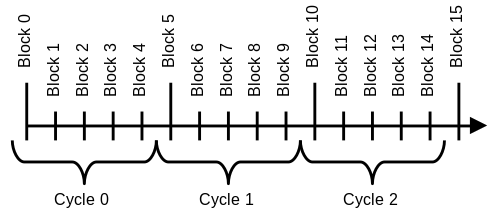
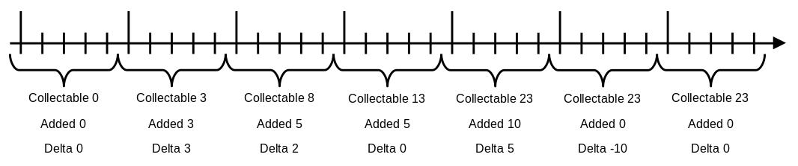
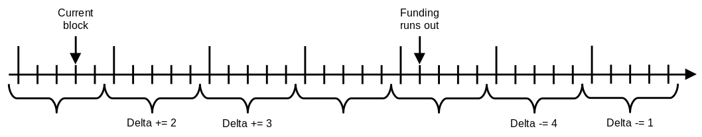
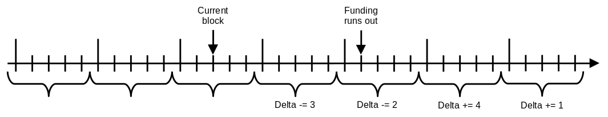
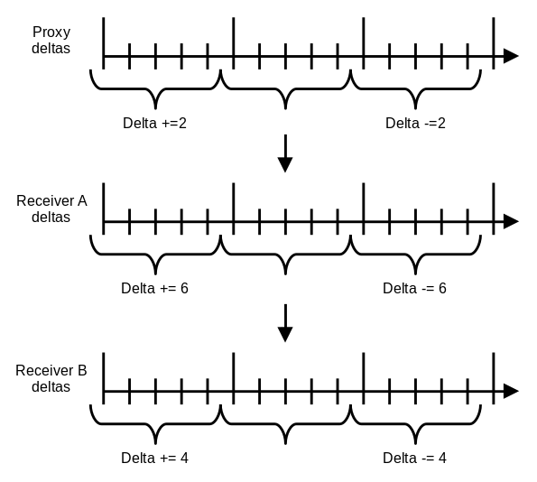
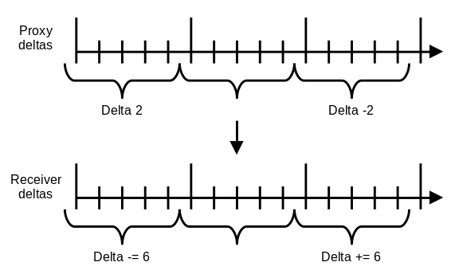
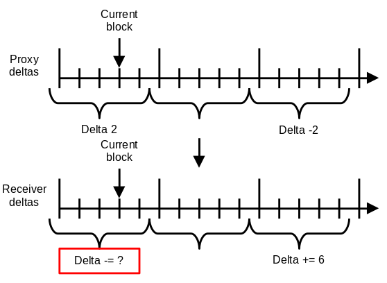

This document is an introduction to understanding how the funding pool contract works.
It doesn't describe all the implementation details or the API,
it focuses on the basic principles of the core mechanics.

# Overview

The funding pool is a smart contract which creates real-time streams of donations.
One can start, alter or end the process of sending their funds at any time with immediate effect.
The flow of funds is automatically maintained and steady over time.

There are 3 roles present in the contract.
Any Ethereum address can simultaneously take on any of these roles.

- **The sender**: has assets and chooses who do they want to send them to,
how much, and at what rate
- **The receiver:** receives funds from senders
- **The proxy**: receives funds from senders,
but immediately passes them to receivers of their choice

## The cycles

The whole blockchain history is divided into cycles of equal duration
so that every block is assigned to a cycle based on its timestamp.
Cycles are numbered starting with zero.
In the examples below, we assume that the cycle length is 5 seconds.

# The sender

The sender has a balance, a funding rate, and a set of receivers.

The balance is automatically reduced by the funding rate every second
and the same amount is credited to the sender's receivers.
When the sender's balance reaches an amount lower than the per-second funding rate,
the funding is stopped.
This process doesn't actually require updates every second,
its effects are calculated on the fly whenever they are needed.
Thus the contract state is updated only when the funding parameters are altered by the users.

The sender balance is manually increased by topping up,
which requires sending the assets from the user wallet to the contract.
The opposite operation is withdrawal,
which results in sending the assets from the contract back to the user wallet.

This funding rate stays constant over time unless explicitly updated.

The sender maintains a list of receivers, each of them with a weight.
The weights regulate how the funded amount is split between the receivers.
For example, a receiver with weight 2 is going to get a share twice as big
as a receiver with weight 1, but only half as big as another receiver with weight 4.

## The deltas

Every second funds from the sender’s pool account are credited to the sender’s receivers
according to the funding rate.
The receiver can collect funds sent in a given second only when the cycle containing it is over.

Here, we see the timeline of a receiver who is receiving funds from two senders.
Each of the senders has sent different amounts over different periods of time.
At the end of each cycle, the collectable amount was increased by the total sent amount.

The receiver needs to know, how much was sent to them on each cycle.
For every receiver we store the amount of funds received in the last collected cycle.
In addition we store changes to this value for the following cycles.
This allows us to calculate the funds that the receiver receives in each not yet collected cycle.

In this example, we start with having the raw **collectable** value of 23 for every second until
the end of time.
Next, we reduce that to storing values **added** to the collectable amount on each cycle.
Now we need to describe only cycles when receiving anything.
The senders usually are sending constant per-cycle amounts over long periods of time, so
the added values tend to create long series of constant numbers, in this case, 5s.
We exploit that and finally turn them into **deltas** relative to the previous cycles.
Now we need to store data only for cycles where the funding rate changes, it's very cheap.
This is what the contract actually stores: a mapping from cycle numbers to deltas.

## Starting sending

In order to start sending, the sender needs to have a non-zero funding rate,
a balance of at least the said funding rate and a non-empty list of receivers.
As soon as the sender is updated to match these criteria, the flow of assets starts.
First, the funding period is calculated.
Its start is the current block timestamp and its end is the moment on which the balance will run out.
Next, for each receiver, the weighted share of the funding rate is calculated.
The receiver's deltas are updated to reflect that during the whole sending period every second
it's going to receive the calculated amount.

Let's take a look at an example of an application of a delta.
The sender will be sending 1 per second or 5 per cycle.

The deltas are applied relative to the existing values.
It doesn't matter if anybody else is funding the receiver, it won't affect this sender.

Another important point is that the delta changes are usually split between two cycles.
This reflects that the first cycle is only partially affected by the change in funding.
Only the second one is fully affected and it must apply the rest of the delta.

In this case, the total change of the per-cycle delta is +5 to start sending.
The current cycle isn't fully affected though, only 2 out of 5 seconds are sending.
It's effectively going to transfer only the amount of 2, which is reflected in the +2 delta change.
On the other hand, the next cycle and the ones after it are going to transfer the full 5.
This is expressed with the +3 delta change, which turns 2 per cycle into the full 5 per cycle.

A similar logic is applied to express the end of the funding period.
The cycle in which funding runs out has 1 transferring second resulting in delta being -4.
The following cycle doesn't transfer any funds and has delta -1 to complete zeroing of the rate.

## Stopping sending

When funding is stopped, the deltas need to be reverted.
To do that basically the same process is applied, just with negative deltas.
Because the already sent funds are out of the sender's control, the past deltas must stay untouched
and only the effects on the receiver's future must be erased.

In this case, the reverting is split into 2 cycles too, one with -4 and the other with -1.

Let's assume that a few seconds have passed, but the sender wants to stop sending.
This can happen because the sender doesn't want to fund the receiver anymore
or because they want to change some of its configuration.
In the latter case sending is stopped only to be immediately resumed, but with different parameters.
Either way, the effects of the sender on the receiver's deltas need to be reverted
from the current timestamp to the end of the existing funding period.

The old funding end deltas are reverted because they don't reflect the real funding end anymore.
On the other hand, a new end is applied to the current timestamp,
just as if it was always supposed to be the end of the funding period.
Now the receiver's future isn't affected by the sender anymore.
The past stays untouched because the already sent funds are out of the sender's control.

# The receiver

There are no setup steps for one to become a receiver.
Any address can receive donations at any time, from any sender.
The only function of this role is the collection of funds sent by others.

## Collecting

The receiver can at any time collect the funds sent to it.
The contract calculates the total amount and then transfers it out to the receiver's wallet.
The collected amount is always everything available at a given moment, there's no way to limit it.

As shown in the previous sections, the collectable amount is described with deltas, one per cycle.
The receiver stores the number of the first cycle, for which the funds haven't been collected yet.
This assures that funds can be collected only once.
The receiver also stores the amount, which was collected for the last collected cycle.
This value is set to 0 if this is the first collection of the receiver.
It's the initial value to which the deltas are added.

To calculate, how much the receiver can collect,
the contract iterates over all the completed cycles since the first uncollected one.
For each of them, it adds the corresponding delta to the value collected from the previous cycle.
This reconstructs the amount sent from all the senders during each cycle.
These amounts are then added up and the result is the total collected amount.
Finally, the next uncollected cycle number and the last cycle amount are updated.

In this example funds received from 4 cycles are being collected.
The yellow fields are the stored state before the collection, green after it.
The blue field is the collected value, which is going to be transferred to the sender's wallet.

# The proxy

Multiple senders can send funds to a proxy and the owner
controls how these funds are further distributed to receivers.

The proxy is configured only with a list of receivers with an associated weight.
The sum of the receivers' weights must always be a constant value,
which is defined in the contract and it's the same for all the proxies.
A proxy, which has never been configured has no receivers and it's impossible to send funds via it.
After the first configuration, it's impossible to disable the proxy, it's forever active.
It can be reconfigured, but it must preserve the constant receivers' weights sum.

Just like a receiver, the proxy has a mapping between the cycles and the deltas of received amounts.

## Sending via a proxy

When a sender starts sending funds to a proxy, it does so in two steps.
First it applies changes to the proxy's deltas similarly to how it would do with a receiver.
Next, it iterates over all the proxy's receivers and applies changes to
their deltas as if they were directly funded by the sender.
The funding rate applied to the receivers is split according to their weights in the proxy.

For the example sake let's assume that the delta's proxy weights sum must be equal to 5.
The proxy has 2 receivers: A with weight 3 and B with weight 2.
The sender wants to start sending via the proxy 2 per second or 10 per cycle.
It's 2 per cycle per proxy weight.

The proxy's deltas store amount per 1 proxy weight, which is 2.
The receivers get their shares, A with weight 3 gets 6 and B with weight 2 gets 4 per cycle.

When a sender stops sending, the process is reversed like with regular receivers.
All the deltas are once again applied, but with negative values.

## Updating a proxy

When the list of proxy receivers is updated, all funding must be moved to a new set of receivers.
That's when the proxy's deltas come useful.
For each cycle and each receiver, the proxy can tell the total delta it has applied.
It can then use this information to erase its future contributions from its receivers.

In this example, the receiver's weight is 3.
To erase the future contribution, the proxy's deltas are multiplied by
the receiver's weights and subtracted from the corresponding receiver's deltas.

After removing its contributions from one set of receivers the proxy must reapply them on a new set.
This is done in the same way as removal, but this time the deltas are added and not subtracted.

### The current cycle problem

Unlike the senders, the proxies store data with a per-cycle precision.
When changing the set of receivers, a delta describing the current cycle may need to be applied.
When it happens, it's unclear what part of the per-cycle delta should be moved,
because some funds were sent before the current timestamp and some will be sent after it.

The solution is to ignore the problem and move the whole current cycle delta.
Some funds already sent in the current cycle may disappear from one receiver and appear in another.
Such behavior, however, is not of significant importance since
the receivers have no access to funds coming from an unfinished cycle.
The senders aren't strongly affected either, they already sent these funds and they trust the proxy.
